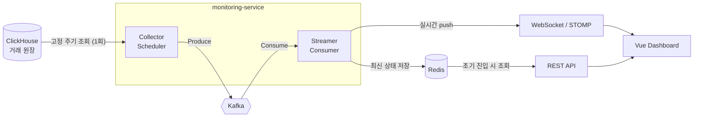
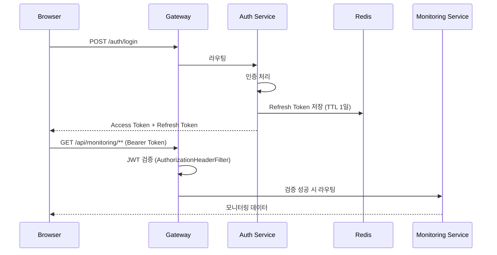

# VAN Monitoring System

> Kafka 기반 Event-Driven 아키텍처로 결제 트랜잭션을 실시간 모니터링하는 MSA 프로젝트


---

## 개요

VAN(Value Added Network) 결제 시스템을 운영하면서 가장 자주 마주친 문제는 "기존 관제 시스템이 비즈니스 지표를 보여주지 못한다"는 것이었습니다. 인프라 지표(CPU, 메모리)는 보여주지만, 카드사·간편결제사별 거래량이나 실시간 거절률 같은 비즈니스 관점의 데이터는 별도로 SQL을 직접 돌려야 확인할 수 있었습니다.

이 프로젝트는 그 문제를 직접 풀어보기 위해 **개인 학습 환경에서 처음부터 다시 설계하고 구현한 포트폴리오 프로젝트**입니다. 실제 회사 폐쇄망 환경에서는 이 구조를 가져가 사내 인프라(Nexus, 사내망 등)에 맞게 별도로 커스터마이징하여 적용했으며, 이 리포지토리는 그 원형이 되는 개인 구현체입니다.

핵심 목표는 하나였습니다. **동시 접속자가 몇 명이든, DB에 가는 부하는 항상 일정해야 한다.**

---

## 아키텍처

기존의 Polling 방식(클라이언트가 접속할 때마다 DB를 직접 조회)은 접속자가 늘어날수록 DB 부하가 선형으로 증가하는 구조적 문제가 있습니다. 이를 해결하기 위해 **데이터 수집(Collector)과 전파(Streamer)의 역할을 분리**하는 Event-Driven 아키텍처를 적용했습니다.



**동작 흐름**

1. `MetricCollectorScheduler`가 고정된 스케줄러 주기로 ClickHouse 원장 테이블을 **딱 한 번만** 조회합니다.
2. 조회 결과를 Kafka 토픽(`van.dashboard.itmx.*`)으로 발행(Produce)합니다.
3. `MetricEventConsumer`가 이를 수신해 두 가지 작업을 동시에 수행합니다.
   - WebSocket(STOMP)으로 현재 연결된 모든 클라이언트에게 실시간 전파
   - Redis에 최신 상태를 `*::latest` 키로 캐싱
4. 신규 클라이언트가 접속하면 REST API(`DashboardQueryService`)가 Redis 캐시를 즉시 반환해, DB를 다시 조회하지 않고도 빠른 초기 로딩을 제공합니다.

이 구조에서는 **클라이언트가 1명이든 1,000명이든 ClickHouse 조회 횟수는 항상 동일**합니다. DB 부하와 클라이언트 수가 완전히 분리되는 것이 이 아키텍처의 핵심입니다.

### 인증 흐름



Access Token이 만료되면 프론트엔드(axios interceptor)가 401 응답을 감지해 Refresh Token으로 자동 재발급을 시도하고, 실패 시에만 로그인 페이지로 리다이렉트합니다.

---

## 핵심 설계 포인트

**DB 부하 격리** — Polling 방식의 구조적 한계를 Producer/Consumer 분리로 해결했습니다. Kafka가 수집과 전파 사이의 완충 역할을 하기 때문에, 접속자 수가 늘어나도 ClickHouse에 가는 쿼리 수는 변하지 않습니다.

**Redis의 두 가지 역할** — 단순 캐싱 도구가 아니라 용도를 분리해서 사용했습니다. `auth-service`에서는 `@RedisHash`로 Refresh Token을 TTL 기반으로 관리하고, `monitoring-service`에서는 신규 접속자를 위한 최신 데이터 스냅샷을 저장합니다.

**WebSocket과 REST의 하이브리드 전략** — 초기 데이터는 REST + Redis로 빠르게 채우고, 이후 변경분만 WebSocket으로 실시간 전송합니다. 매번 전체 데이터를 다시 보내지 않아 네트워크 트래픽을 줄였습니다.

**Spring Cloud Config 중앙화** — 5개 서비스의 환경설정(Redis, Kafka, JWT secret, DB 접속정보)을 Config 서버 한 곳에서 관리합니다. 민감 정보는 Jasypt로 암호화(`ENC(...)`)해 평문으로 노출되지 않도록 했습니다.

**Gateway 레벨 JWT 검증** — 각 서비스가 개별적으로 인증 로직을 구현하지 않도록, `gateway-service`의 `AuthorizationHeaderFilter`에서 JWT 유효성을 한 번에 검증한 뒤 내부 서비스로 라우팅합니다.

---

## 기술 스택

| 영역 | 기술 |
|---|---|
| Language | Java 17 |
| Framework | Spring Boot 3.5, Spring Cloud 2025.0 |
| Service Discovery | Netflix Eureka |
| API Gateway | Spring Cloud Gateway (WebFlux) |
| 중앙 설정관리 | Spring Cloud Config Server (native profile), Jasypt |
| 메시징 | Apache Kafka (spring-kafka) |
| 캐시 / 토큰 저장 | Redis (RedisTemplate, RedisHash, RedisCacheManager) |
| 실시간 통신 | WebSocket (STOMP), SockJS |
| 인증 | Spring Security, JJWT (Access/Refresh Token) |
| 데이터 조회 | Spring Data JPA, JdbcTemplate, ClickHouse JDBC Driver |
| Frontend | Vue 3, Vite, Vue Router, Axios, ECharts, @stomp/stompjs |
| Build | Gradle (Multi-module) |

---

## 프로젝트 구조

```
van-monitoring-system/
├── discovery-service/      # Eureka Server (8761)
├── config-service/         # Spring Cloud Config Server (8888)
├── gateway-service/        # API Gateway + JWT 검증 (8000)
├── auth-service/           # 로그인 / 토큰 발급·재발급 (8088)
├── monitoring-service/     # Collector + Streamer 핵심 로직 (8081)
├── frontend-vue/           # Vue 3 대시보드 (5173)
└── config-repo/            # 서비스별 환경설정 (Jasypt 암호화)
```

### 모듈별 책임

| 모듈 | 포트 | 책임 |
|---|---|---|
| `discovery-service` | 8761 | 서비스 디스커버리(Eureka Server) |
| `config-service` | 8888 | 서비스별 환경설정 중앙 관리 |
| `gateway-service` | 8000 | 단일 진입점, CORS, JWT 검증, 라우팅 |
| `auth-service` | 8088 | 로그인, Access/Refresh Token 발급 및 재발급 |
| `monitoring-service` | 8081 | ClickHouse 조회(Collector), Kafka 발행/구독, WebSocket 푸시, Redis 캐싱 |
| `frontend-vue` | 5173 | 실시간 대시보드 UI (신용/포인트/현금 거래 현황, 응답코드별 집계) |

---

## 실행 방법

사전에 Kafka, Redis, ClickHouse가 로컬 또는 접근 가능한 환경에 준비되어 있어야 합니다.

```bash
# 1. Eureka 서버 (서비스 디스커버리)
./gradlew :discovery-service:bootRun

# 2. Config 서버 (다른 서비스들이 기동 전에 필요)
./gradlew :config-service:bootRun

# 3. 나머지 서비스 (순서 무관, 병렬 기동 가능)
./gradlew :auth-service:bootRun
./gradlew :gateway-service:bootRun
./gradlew :monitoring-service:bootRun

# 4. 프론트엔드
cd frontend-vue
npm install
npm run dev
```

---

## 향후 계획

현재는 카드/포인트/현금영수증 결제 모니터링까지 구현되어 있습니다. 대시보드 UI에는 이미 다음 두 영역의 자리가 마련되어 있으며, 동일한 Event-Driven 구조로 확장할 예정입니다.

- BatchGW 모니터링 — 정산 파일(SFTP) 송수신 현황
- RTSD 모니터링 — 실시간 거래내역 전송 시스템 상태

---

## 더 알아보기

프로젝트 설계 과정과 트러블슈팅 기록은 Notion 문서에 더 자세히 정리되어 있습니다.

[VAN MSA 프로젝트 상세 문서](https://app.notion.com/p/VAN-MSA-25bc26c9a23680f4a399c7d46b522eaf)

---

이 프로젝트는 개인 학습 및 포트폴리오 목적으로 제작되었으며, 실제 운영 환경의 민감한 정보나 회사 고유 로직은 포함되어 있지 않습니다.
